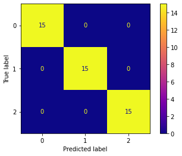

This is a KNN model that classifies what kind of iris a flower is. I coded it up to practice using Sci-Kit learn's StandardScaler, KNeighborsClassifier, and plot_confusion_matrix functions.

these were my results on the testing data...

0 = Setosa
1 = Versicolor
2 = Virginica

The K-nearest neighbors (KNN) technique can be very effective on relativley small datasets, in multi-class classification problems, but can run into dimsionality issues with larger datasets.
